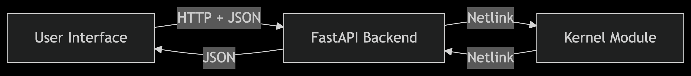

# K-Wall

**K-Wall** is a modern, high-performance Linux firewall solution that bridges low-level kernel power with intuitive user control. Designed for security researchers, sysadmins, and power users, kwall delivers real-time packet control, rule management, and live logging — all through a clean API and web UI.

---

## ✨ Key Features

- 🔐 **Deep Packet Control** – Built directly on Netfilter for native kernel-level filtering
- ⚡ **Real-Time Monitoring** – Logs and events are streamed every second to user space
- 🧠 **Smart API Backend** – FastAPI powered interface for full rule/config control
- 🌐 **Web UI** – Lightweight frontend to manage rules, monitor logs, and configure settings
- 💾 **Persistent Storage** – Uses SQLite + SQLAlchemy for fast and reliable rule storage

---

## 📦 Architecture


- Efficient communication between kernel and user space via Netlink sockets
- Backend handles all logic, logging, rule CRUD, and DB operations
- Frontend enables real-time interaction with logs and rules

---

## 🚀 Quick Start

### 1. Clone and Install

```bash
git clone https://github.com/47hxl-53r/K-Wall.git
cd K-Wall
chmod +x setup.sh
sudo ./setup.sh
```
The web UI will be running on port 9877.

